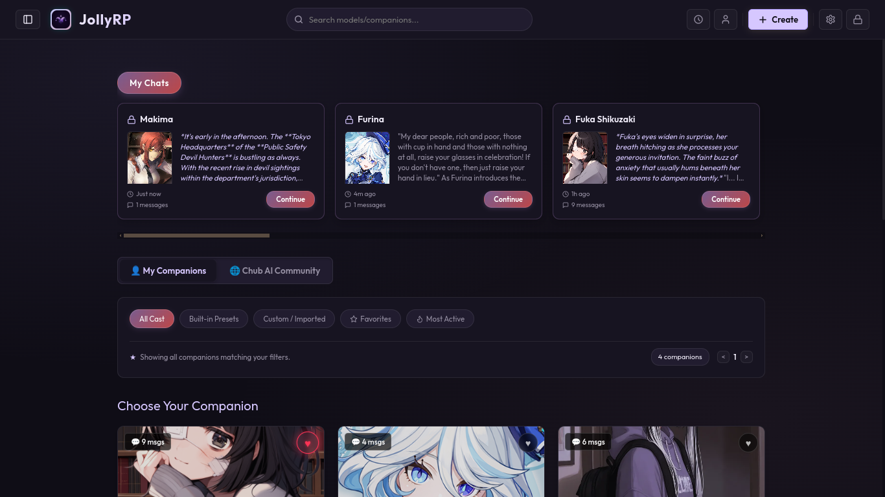
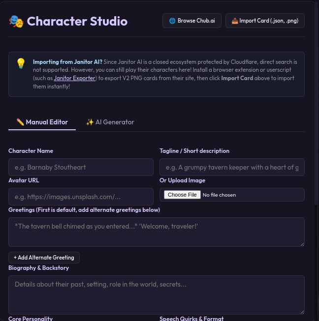
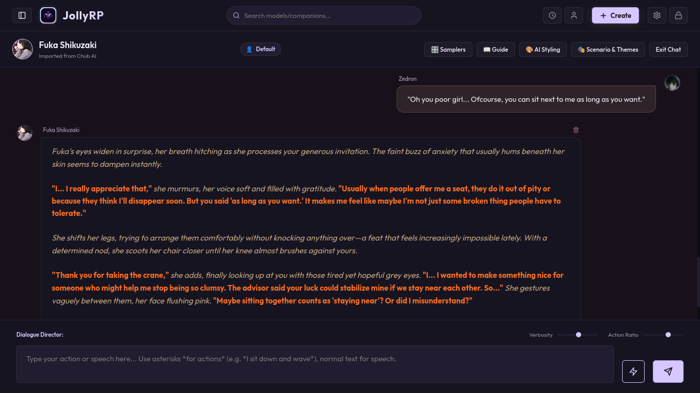
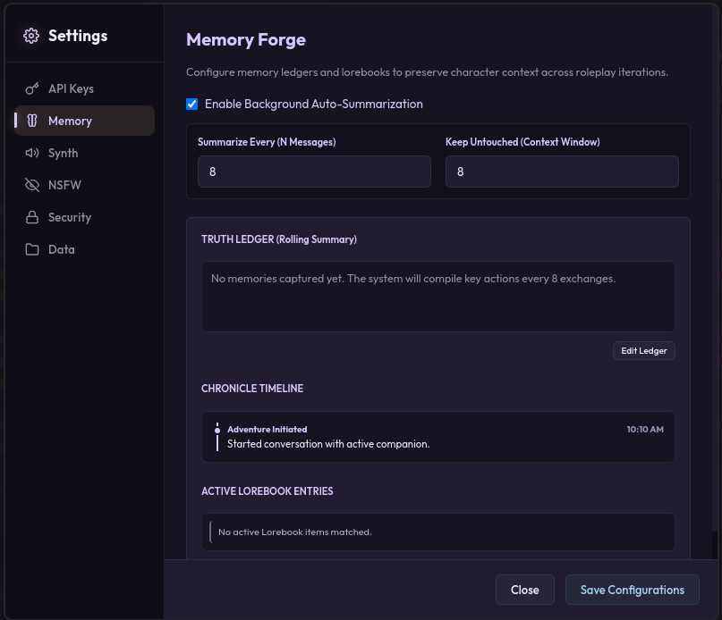
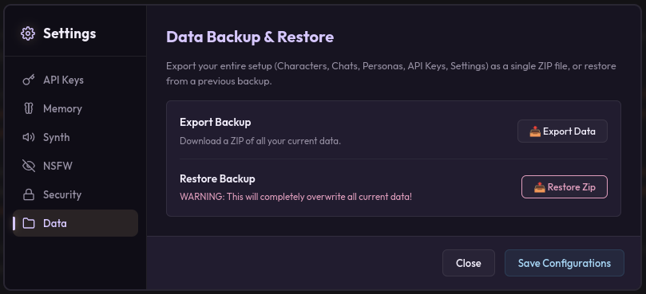

<div align="center">
  
  
  # JollyRP

  **A Premium, Fully Uncensored Local AI Roleplay Client.**

  [](https://opensource.org/licenses/MIT)
  [](https://github.com/YourUsername/JollyRP/releases)
  
  JollyRP is a stunning, high-performance desktop application designed for immersive, private, and uncensored interactions with AI characters. Built with a sleek glassmorphism UI and intelligent memory ledgers, it pushes the boundaries of AI text adventures.

  <br />

  [](https://github.com/YourUsername/JollyRP/releases/latest)
  [](https://github.com/YourUsername/JollyRP/releases/latest)
</div>

<br />

<div align="center">
  
</div>

---

## ✨ Features

- **🎭 Uncensored & Local**: Your data never leaves your machine. Full AES-256 encryption protects your API keys locally. No filters, no tracking.
- **🧠 Memory Ledger**: A visual memory manager that lets you view, edit, and inject context dynamically into your character's brain.
- **🎨 Stunning UI**: A rich, dark-mode glassmorphism interface featuring dynamic blur effects, smooth micro-animations, and a highly customizable chat layout.
- **📦 1-Click Backup**: Export your entire application state (Characters, Chats, API Keys) into a secure zip file and restore it seamlessly.
- **🖥️ Universal Support**: Bring your own keys (OpenAI, Anthropic, OpenRouter) or seamlessly hook into your local LLMs (Ollama, LMStudio, Text Generation WebUI).

---

## 📸 Gallery

<div align="center">
  <table>
    <tr>
      <td align="center"><b>Character Studio</b><br></td>
      <td align="center"><b>Chat Interface</b><br></td>
    </tr>
    <tr>
      <td align="center"><b>Memory Ledger</b><br></td>
      <td align="center"><b>Data Management</b><br></td>
    </tr>
  </table>
</div>

---

## 🚀 Installation

### Download the App
Head over to the [Releases](https://github.com/YourUsername/JollyRP/releases) page to download the latest native installer:
- **Windows**: Download the `.exe` installer.
- **Linux**: Download the `.deb` or `.AppImage`.

### Build from Source
If you prefer to compile it yourself:

```bash
# 1. Clone the repository
git clone https://github.com/YourUsername/JollyRP.git
cd JollyRP

# 2. Install dependencies
npm install

# 3. Build the executables
npm run dist:win    # For Windows (.exe)
npm run dist:linux  # For Linux (.deb / .AppImage)
```

*(Note: The built output will appear in the `release/` directory.)*

---

## 💻 Development
To run JollyRP locally in your browser for development purposes:

1. Open a terminal and run the backend server:
   ```bash
   node src/server.js
   ```
2. Open a second terminal and start the Vite frontend:
   ```bash
   npm run dev
   ```
3. Navigate to `http://localhost:5173` in your browser.

---

## 🤝 Contributing
Contributions, issues, and feature requests are welcome! Feel free to check the [issues page](https://github.com/YourUsername/JollyRP/issues).

## 📝 License
This project is licensed under the MIT License - see the `LICENSE` file for details.
